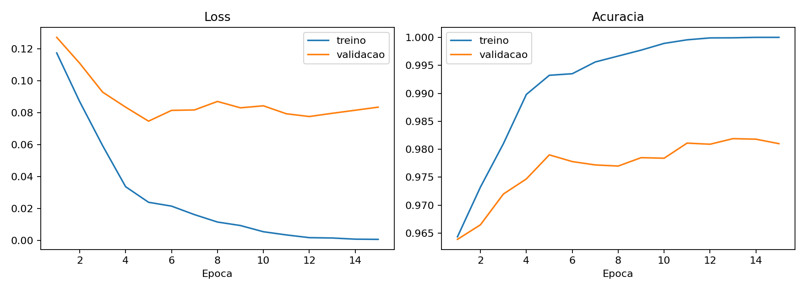
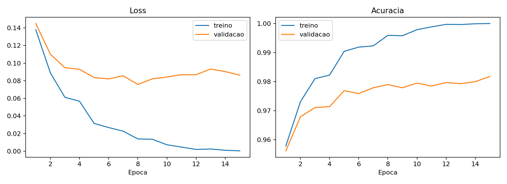
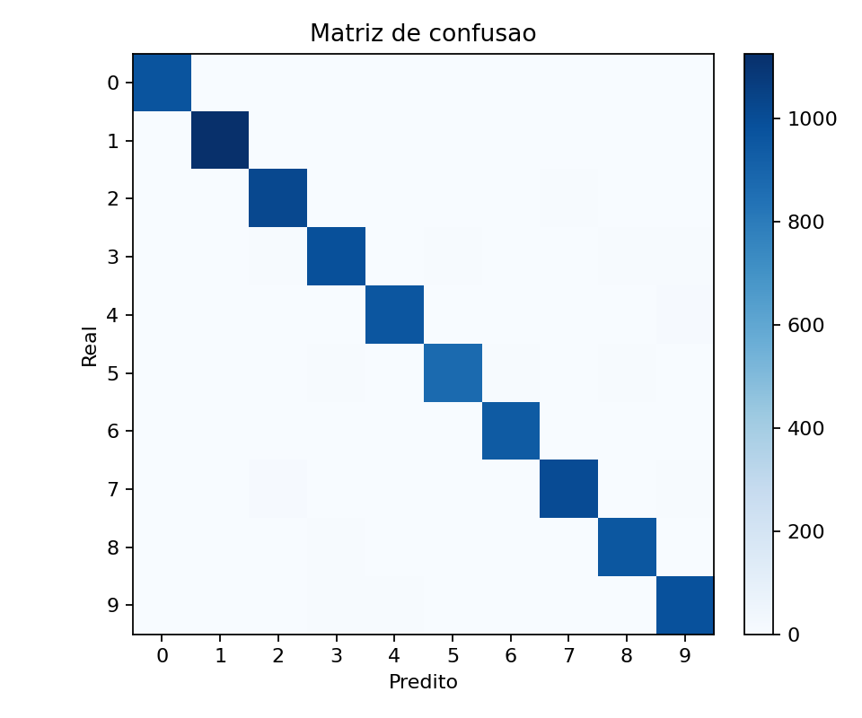

# MLP do Zero no MNIST

Este projeto implementa um Multi-Layer Perceptron usando apenas NumPy para os calculos da rede neural. O carregamento do MNIST tenta usar Keras quando disponivel; se Keras/TensorFlow nao estiver instalado, o script baixa os arquivos IDX oficiais do MNIST diretamente.

## Como rodar

Crie e ative um ambiente virtual:

```bash
python -m venv .venv
.venv\Scripts\activate
pip install -r requirements.txt
```

Treine a configuracao principal:

```bash
python -m scripts.train_mnist --run-name baseline_relu --layers 784-256-128-10 --epochs 15 --learning-rate 0.05 --momentum 0.9
```

Rode a comparacao entre duas arquiteturas:

```bash
python -m scripts.run_experiments
```

Rode o teste de gradiente:

```bash
python tests/test_gradients.py
python -m pytest tests/test_gradients.py
```

Se `pytest` ainda nao estiver instalado, o comando direto `python tests/test_gradients.py` ja valida o backpropagation.

Os arquivos gerados ficam em `results/`: metricas em JSON, curvas de loss/acuracia, matriz de confusao e tabela de experimentos.

## Arquitetura escolhida

A configuracao principal e:

- Entrada: 784 valores, um para cada pixel normalizado da imagem 28x28.
- Camada oculta 1: 256 neuronios com ReLU.
- Camada oculta 2: 128 neuronios com ReLU.
- Saida: 10 neuronios com softmax, um por digito.
- Loss: cross-entropy.
- Otimizador: SGD com learning rate configuravel e momentum opcional.

Escolhi duas camadas ocultas porque o enunciado pede ao menos duas e porque essa arquitetura ainda e pequena o suficiente para treinar rapido em NumPy. A ReLU simplifica os gradientes, reduz saturacao em comparacao com `tanh` e combina bem com inicializacao He. A saida usa softmax + cross-entropy porque esse par transforma os logits em probabilidades e produz um gradiente simples: `probabilidades - rotulos_one_hot`.

## Resultados

Estes foram os resultados obtidos no conjunto de teste do MNIST:

| Experimento | Arquitetura | Ativacao | Learning rate | Momentum | Accuracy | Recall macro | F1 macro |
| --- | --- | --- | --- | --- | --- | --- | --- |
| baseline_relu | 784-256-128-10 | ReLU | 0.05 | 0.9 | 0.9812 | 0.9810 | 0.9811 |
| deeper_relu | 784-256-128-64-10 | ReLU | 0.03 | 0.9 | 0.9823 | 0.9821 | 0.9821 |

Tambem acompanhei o possivel overfitting comparando treino, validacao e teste:

| Experimento | Train accuracy | Validation accuracy | Test accuracy | Gap treino-validacao |
| --- | --- | --- | --- | --- |
| baseline_relu | 1.0000 | 0.9810 | 0.9812 | 0.0190 |
| deeper_relu | 1.0000 | 0.9818 | 0.9823 | 0.0182 |

Arquivos esperados:

- `results/baseline_relu_curves.png`: curva de loss e acuracia.
- `results/baseline_relu_confusion.png`: matriz de confusao.
- `results/baseline_relu_metrics.json`: metricas finais.
- `results/baseline_relu_classification_report.csv`: precision, recall e F1 por digito.
- `results/experiments.csv`: tabela comparativa.

A meta do trabalho era atingir acuracia de teste maior ou igual a 92%. As duas configuracoes passaram essa meta com folga.

### Curvas de treinamento

As curvas abaixo mostram a evolucao da loss e da acuracia ao longo das epocas. A loss cai de forma consistente e a acuracia de treino sobe ate `1.0000`, enquanto a validacao estabiliza perto de `0.98`. Essa diferenca indica overfitting leve: a rede memorizou o treino, mas ainda manteve boa generalizacao no conjunto de validacao e teste.

**baseline_relu**



**deeper_relu**



### Matrizes de confusao

As matrizes de confusao mostram quantas imagens de cada digito foram classificadas corretamente ou confundidas com outros digitos. A diagonal principal concentra quase todos os exemplos, o que confirma o bom desempenho. Ainda assim, existem erros fora da diagonal: a `baseline_relu` errou 188 imagens de teste e a `deeper_relu` errou 177.

**baseline_relu**



**deeper_relu**


## Decisoes e dificuldades

1. A decisao tecnica mais dificil foi escolher uma arquitetura que passasse de 92% sem transformar o projeto em uma caixa-preta dificil de explicar. Eu escolhi `784-256-128-10` como baseline porque ela tem duas camadas ocultas, aprende bem o MNIST e ainda deixa o backpropagation facil de acompanhar. Depois comparei com `784-256-128-64-10` para testar se uma camada extra traria ganho real.

2. O que mais me chamou atencao foi que, com 15 epocas, a acuracia de treino chegou a `1.0000`, mas validacao e teste ficaram perto de `0.982`. No inicio isso parecia erro de metrica, mas a matriz de confusao mostrou que ainda havia erros no teste. Aprendi a olhar treino, validacao e teste juntos antes de concluir que o modelo esta perfeito.

3. Tambem tive dificuldade com o ambiente de dados. O codigo tenta carregar o MNIST por `keras.datasets.mnist`, mas no meu ambiente local o TensorFlow/Keras nao estava disponivel. Por isso deixei um fallback que baixa os arquivos IDX oficiais do MNIST, mantendo o treinamento da rede todo em NumPy.

4. Se eu fosse refazer do zero, eu implementaria early stopping e talvez regularizacao L2 desde o inicio. Isso ajudaria a evitar que a rede memorizasse totalmente o treino nas ultimas epocas, mesmo mantendo a acuracia de teste acima da meta.

## Como o codigo funciona

O projeto foi separado em arquivos pequenos para deixar claro o papel de cada parte da rede:

- `mlp/activations.py`: implementa `relu`, `tanh` e suas derivadas. A funcao `get_activation` permite escolher a ativacao por nome.
- `mlp/losses.py`: implementa `softmax`, `cross_entropy`, `accuracy` e `one_hot`.
- `mlp/optimizers.py`: implementa SGD com learning rate configuravel e momentum opcional.
- `mlp/network.py`: contem a classe `MLP`, responsavel por inicializar pesos, executar forward pass, backpropagation, treino, predicao e avaliacao.
- `scripts/train_mnist.py`: carrega o MNIST, treina uma configuracao, salva metricas, curva de treino e matriz de confusao.
- `scripts/run_experiments.py`: roda as duas configuracoes comparadas e gera `results/experiments.csv`.
- `tests/test_gradients.py`: faz um gradient check numerico em uma rede pequena.

### Ativacoes e arquitetura configuravel

Em `mlp/activations.py`, cada ativacao tem duas funcoes: a funcao direta e sua derivada. Para ReLU, `relu(z)` aplica `max(0, z)`, enquanto `relu_derivative(z)` retorna `1` onde `z > 0` e `0` no restante. Essa derivada e o que permite propagar o erro para as camadas anteriores no backpropagation. Tambem deixei `tanh` implementada para permitir comparacoes simples de ativacao.

A funcao `get_activation(name)` devolve o par `(ativacao, derivada)` a partir de uma string. Por isso a rede pode ser criada com:

```python
MLP([784, 256, 128, 10], activation="relu")
```

A lista `[784, 256, 128, 10]` define toda a arquitetura: entrada com 784 atributos, duas camadas ocultas com 256 e 128 neuronios, e saida com 10 classes. Internamente, `network.py` percorre essa lista para criar os pesos `W1`, `W2`, `W3` e biases `b1`, `b2`, `b3`. Com isso, a mesma classe tambem aceita uma rede mais profunda, como `[784, 256, 128, 64, 10]`, sem reescrever o forward ou o backward.

Na inicializacao, usei escala `sqrt(2 / fan_in)` quando a ativacao e ReLU. Essa e a ideia da inicializacao He: manter a variancia das ativacoes mais estavel ao passar por varias camadas. Os biases comecam em zero, porque a quebra de simetria ja acontece nos pesos aleatorios.

### Loss, otimizador e metricas

Em `mlp/losses.py`, a funcao `softmax` transforma os logits da ultima camada em probabilidades. A `cross_entropy` mede o quanto a probabilidade atribuida a classe correta esta distante do ideal. Tambem existe `one_hot`, que converte rotulos como `3` ou `7` em vetores de classe para facilitar o calculo do gradiente da saida.

Em `mlp/optimizers.py`, o SGD atualiza cada peso na direcao oposta ao gradiente. O parametro `learning_rate` controla o tamanho do passo, e o `momentum` reaproveita parte da atualizacao anterior para suavizar os movimentos durante o treinamento.

### Metodos principais da classe `MLP`

A classe `MLP`, em `mlp/network.py`, concentra o funcionamento da rede:

- `__init__`: recebe `layer_sizes`, ativacao e seed; guarda a arquitetura e escolhe a funcao de ativacao.
- `_init_params`: cria pesos e biases de cada camada. Os pesos ficam em chaves como `W1`, `W2`, `W3`; os biases ficam em `b1`, `b2`, `b3`.
- `forward`: calcula as ativacoes camada por camada e salva os valores intermediarios em `cache`.
- `compute_loss`: executa o forward e calcula a cross-entropy, sendo usado tambem no gradient check.
- `backward`: percorre as camadas de tras para frente e calcula os gradientes de pesos e biases.
- `fit`: executa o loop de treino com embaralhamento, mini-batches, forward, backward e atualizacao por SGD.
- `predict_proba`: retorna as probabilidades da softmax.
- `predict`: retorna a classe com maior probabilidade.
- `evaluate`: calcula loss e acuracia em treino, validacao ou teste.

### Forward pass

A classe `MLP` aceita uma lista de tamanhos de camada, como `[784, 256, 128, 10]`. Isso evita escrever uma rede fixa: o mesmo codigo funciona para duas, tres ou mais camadas ocultas. Nos scripts, a mesma arquitetura e passada pela linha de comando como `784-256-128-10` e convertida para lista por `parse_layers`.

Para cada camada oculta, o codigo calcula:

```python
Z = A_anterior @ W + b
A = relu(Z)
```

Na camada final, calcula os logits e aplica softmax:

```python
logits = A_anterior @ W + b
probs = softmax(logits)
```

A softmax transforma os logits em probabilidades por classe. Para evitar overflow numerico, o codigo subtrai o maior logit de cada linha antes de aplicar `exp`.

### Backpropagation

Como a saida usa softmax com cross-entropy, o gradiente inicial fica simples:

```python
dZ = (probs - y_one_hot) / batch_size
```

Depois, para cada camada, o codigo calcula:

```python
dW = A_anterior.T @ dZ
db = soma(dZ)
dZ_anterior = (dZ @ W.T) * derivada_relu(Z_anterior)
```

Essa divisao por `batch_size` deixa a escala do gradiente estavel quando o tamanho do mini-batch muda. O teste em `tests/test_gradients.py` compara esse gradiente analitico com uma aproximacao numerica por diferenca finita.

### Treinamento e avaliacao

O metodo `fit` embaralha o conjunto de treino, divide os dados em mini-batches, executa forward/backward e atualiza os pesos com SGD. Ao final de cada epoca, salva loss e acuracia de treino e validacao.

O script `train_mnist.py` tambem calcula metricas de teste:

- accuracy;
- precision macro e weighted;
- recall macro e weighted;
- F1 macro e weighted;
- balanced accuracy;
- matriz de confusao;
- relatorio por digito com precision, recall, F1 e support.

### Funcoes auxiliares dos scripts

Em `scripts/train_mnist.py`, algumas funcoes existem para separar responsabilidades:

- `load_mnist`: carrega o MNIST, normaliza os pixels para `[0, 1]`, transforma cada imagem 28x28 em vetor de 784 posicoes e separa validacao.
- `load_mnist_from_idx`: fallback que baixa os arquivos IDX oficiais do MNIST quando Keras/TensorFlow nao esta disponivel.
- `_read_idx_images` e `_read_idx_labels`: leem os arquivos compactados do MNIST no formato IDX.
- `parse_layers`: transforma uma string como `784-256-128-10` em `[784, 256, 128, 10]`.
- `plot_history`: gera o grafico de loss e acuracia por epoca.
- `confusion_matrix`: monta a matriz de confusao a partir dos rotulos reais e preditos.
- `classification_metrics`: calcula precision, recall, F1, balanced accuracy e metricas por classe a partir da matriz de confusao.
- `write_classification_report`: salva o relatorio por digito em CSV.
- `training_diagnostics`: compara treino, validacao e teste para indicar possivel overfitting.
- `plot_confusion_matrix`: salva a matriz de confusao como imagem.

Em `scripts/run_experiments.py`, a funcao `main` roda as configuracoes definidas em `EXPERIMENTS`, chama o treinamento de cada uma e consolida os resultados finais em `results/experiments.csv`.

## Erros comuns

Se aparecer `No module named 'numpy'`, `pytest` ou `matplotlib`, as dependencias ainda nao foram instaladas no ambiente virtual. Rode:

```bash
pip install -r requirements.txt
```

Se houver erro ao carregar o MNIST, o problema provavelmente esta na conexao ou na permissao para escrever em `data/mnist/`. O codigo tenta usar `keras.datasets.mnist` quando disponivel; se Keras/TensorFlow nao estiver instalado, baixa os arquivos IDX oficiais do MNIST diretamente.

Se a acuracia de treino aparecer como `1.0000`, isso nao significa que o teste tambem ficou perfeito. Neste projeto, treino chegou a 100%, mas teste ficou perto de 98%, indicando overfitting leve.

## Estrutura

```text
.
|-- README.md
|-- mlp/
|   |-- __init__.py
|   |-- activations.py
|   |-- losses.py
|   |-- network.py
|   `-- optimizers.py
|-- notebooks/
|   `-- experimentos.ipynb
|-- results/
|-- scripts/
|   |-- run_experiments.py
|   `-- train_mnist.py
|-- tests/
|   `-- test_gradients.py
`-- requirements.txt
```
